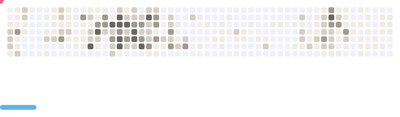

    

  

  

 

<h2 align="left"><b>About me</b></h2>

✨ What I'm working on:  - Building and refining responsive web applications using modern frontend frameworks. 
   🌱 What I'm learning:  - Exploring website security best practices, particularly OWASP guidelines, to ensure secure and reliable applications. 
   🯠Goals:  - To grow into a Principal Developer role, lead impactful projects, and implement secure, scalable solutions within a forward-thinking organization. 
   🧠 Familiarity:  - Agile Scrum   
  

  
📫 How to reach me

  

    <samp>
      <h2 align="center">you can reach me by:</h2>
      

         
        
        
        
        
      

    </samp>
  

 

<h2 align="left">
 <b  align="left"> Tech Stack</b>
  </h2>

  
  
  
  
  
  
  
  
  
  
  
  
  
  
  
 

#### Programming Languages:
- javascript  
- TypeScript  
- Python 
- Golang 👶🏻 
- C 
- Java 🥲  
#### Frontend:
- HTML5 & CSS3
- ReactJS
- NextJS
- Tailwind CSS , SCSS
- Storybook
- Radix | antd | MUI | Daisy | Material tailwind | Shadcn

#### Frontend Testing:
- Testing Library
- Vitest
- Jest
  
#### Backend and Database:

- Prisma
- NodeJS (beginer😿)
- ExpressJS (basic)
- Firebase 
- MySQL  
- PostgreSQL  
- MongoDB

#### Monorepo with:
- Turborepo (basic)
- Lerna (beginner)

## Improve code with
- `Husky`: Leveraging Husky to manage Git hooks.
- `Lint-staged`: Improving code quality and performance by running linters on staged files before commits (beginer 😭).
- `ESLint`: Enforcing consistent code style and identifying problematic patterns in JavaScript/TypeScript code 🥲.
- `Prettier`: Automatically formatting code for better readability and consistency 🚀.

###

## Enjoy

<picture>
  <source media="(prefers-color-scheme: dark)" srcset="images/breakout-dark.svg" />
  <source media="(prefers-color-scheme: light)" srcset="images/breakout-light.svg" />
  
</picture>